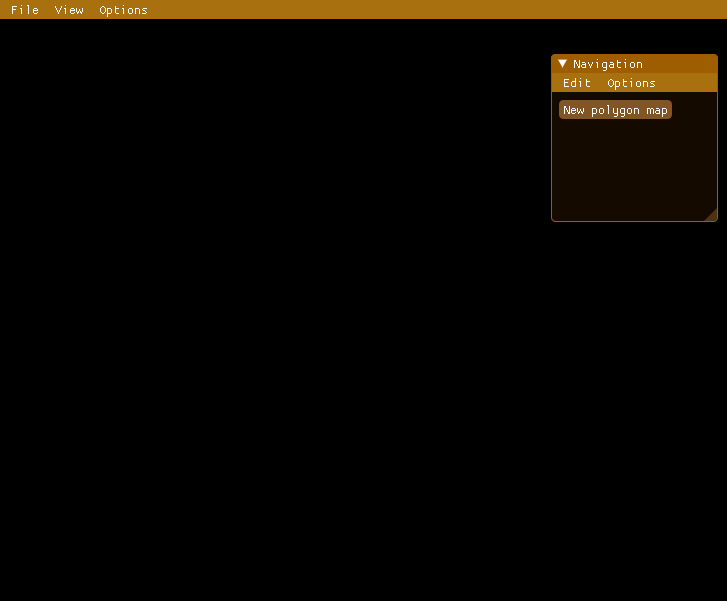

# pathfun editor

A navigation area editor for the [pathfun](https://github.com/apicici/pathfun) Lua library.

Uses [LÖVE](https://love2d.org/) as the engine, [Dear ImGui](https://github.com/ocornut/imgui) for the interface, [clipper](http://www.angusj.com/delphi/clipper.php) for polygon operations, and [polypartition](https://github.com/ivanfratric/polypartition) to partition into convex polygons.

Works on Linux, Windows, and macos.

## Features
- Visual editing the navigation area by adding or subtracting polygons in an intuitive way.
- Testing mode to test pathfinding on the navigation area using pathfun.
- Help window with instructions on hot to use the editor.
- Exports a `.lua` file that returns the navigation data expected from pathfun when required from Lua.

The following animation provides a quick overview of the main features of the editor:

## How to use

The git repository only contains the LÖVE source code (mostly written in [MoonScript](https://moonscript.org/)). To use the editor you can grab a [pre-built release](https://github.com/apicici/clipper-luajit-ffi/releases) (recommended) or compile code and/or libraries yourself.

### Pre-built binaries

Pre-built binaries can be found in the [releases page](https://github.com/apicici/clipper-luajit-ffi/releases) for the following systems/architectures:
* Linux x64
* Windows x86, x64
* macos x64

### Compilation

#### LÖVE archive

1. First you'll need to compile the `.moon` files in the `src` directory with MoonScript (see instructions [here](https://leafo.net/posts/getting_started_with_moonscript.html#creating-programs/compiling-and-running)).
2. Put all the `.lua` files from the `src` directory and the ones compiled with MoonScript in a zip file, preserving the directory structure (`main.lua` should be in the root of the zip file).
3. Rename the zip file to `pathfun-editor.love`.

The `pathfun-editor.love` obtained here cannot be run with LÖVE yet, since it requires compilation of the shared libraries.

#### Shared libraries

The editor needs shared libraries from the following projects:
* [cimgui-love](https://github.com/apicici/cimgui-love) (version 1.83-3)
* [clipper-luajit-ffi](https://github.com/apicici/clipper-luajit-ffi) (version 1.0)

You can either grab the pre-compiled libraries from the project releases or compile them yourself.

#### Running the LÖVE file

1. Place the compiled shared libraries in the same folder as the `pathfun-editor.love` file.
2. Download the LÖVE binaries from https://love2d.org/
3. Run `pathfun-editor.love` using LÖVE.

